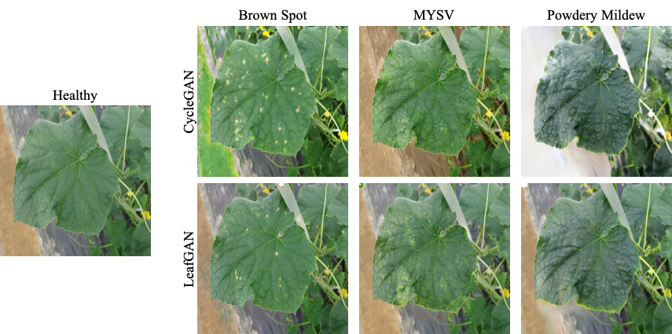

## PlantGAN &mdash; Official Pytorch Implementation



**PlantGAN: An Data Augmentation Method for Practical Plant Disease Diagnosis**<br>


Abstract: *Many applications for the automated diagnosis of plant disease have been developed based on the success of deep learning techniques. However, these applications often suffer from overfitting, and the diagnostic performance is drastically decreased when used on test datasets from new environments. In this Github, we propose different generative AI methods (Conditional GAN, image-to-image translation models, VAEs, and Diffusion models) which generate a wide variety of diseased images via transformation from healthy images, as a data augmentation tool for improving the performance of plant disease diagnosis.*


## Datasets
- Normal dataset: A normal dataset will have 4 directories for two domains A (trainA, testA) and B (trainB, testB). Each directory must contain only images (no other file types).
An example of the dataset named `healthy2brownspot`
```bash
/path/to/healthy2brownspot/trainA
/path/to/healthy2brownspot/testA
/path/to/healthy2brownspot/trainB
/path/to/healthy2brownspot/testB
```
- Masked dataset: This dataset is normal dataset + pre-generated mask images. First, you need to generate your own mask images using the [prepare_mask.py]. An example of the masked dataset named `healthy2brownspot_mask`
```bashf
/path/to/healthy2brownspot/trainA
/path/to/healthy2brownspot/trainA_mask # mask images of trainA
/path/to/healthy2brownspot/testA
/path/to/healthy2brownspot/trainB
/path/to/healthy2brownspot/trainB_mask # mask images of trainB
/path/to/healthy2brownspot/testB
```
## cycleGAN/CycleGAN train/test
- Make sure to prepare the dataset first
- Train a model (example with the dataset `healthy2brownspot`):s
```bash
python train.py --dataroot /path/to/healthy2brownspot --name healthy2brownspot_cycleGAN --model cycle_gan
```
- Train model with mask images (example with the dataset `healthy2brownspot_mask`):
```bash
python train.py --dataroot /path/to/healthy2brownspot --name healthy2brownspot_cycleGAN --model cycle_gan --dataset_mode unaligned_masked
```
To see more intermediate results, check out `./checkpoints/healthy2brownspot_cycleGAN/web/index.html`.
- Test the model:
```bash
python test.py --dataroot /path/to/healthy2brownspot --name healthy2brownspot_cycleGAN --model cycle_gan
```
- The test results will be saved to a html file here: `./results/healthy2brownspot_cycleGAN/latest_test/index.html`.

## Citation

```
@article{cap2020leafGAN,
  title   = {LeafGAN: An Effective Data Augmentation Method for Practical Plant Disease Diagnosis},
  year    = {2020},
  doi     = {10.1109/TASE.2020.3041499}
}
```

## Acknowledgments
Our code is inspired by [pytorch-CycleGAN](https://github.com/junyanz/pytorch-CycleGAN-and-pix2pix).

